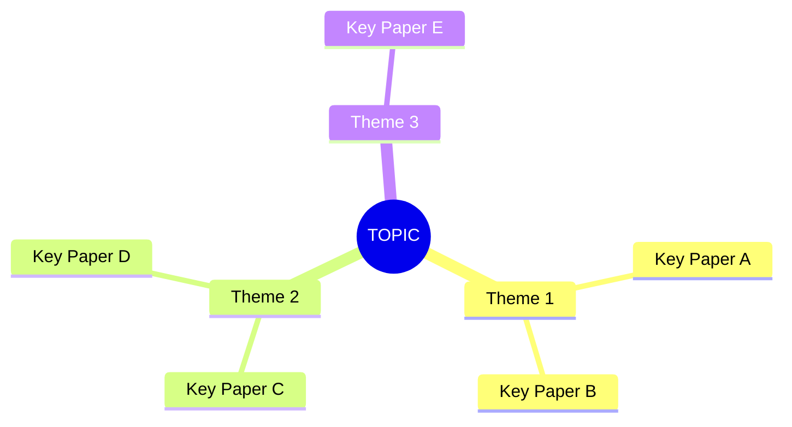

# Lit-All: Parallel Multi-Database Literature Sweep

## Purpose

Run a comprehensive literature search across **all available academic databases simultaneously** using parallel agents. Each agent searches a subset of databases, and results are synthesized into a single deduplicated, thematically organized review.

This is the "wide net" complement to targeted skills like `papercheck` (deep on one paper) and `lit-check` (dimension-based analysis).

## When to Use

- Starting a new research project and need to map the landscape
- Checking if a research idea is novel
- Building a comprehensive bibliography on a topic
- Finding the seminal and recent papers on a question
- Surveying methods used across a literature
- Preparing a literature review section for a paper
- Expanding a previous literature sweep with targeted follow-up searches

## Prerequisites — MCP Servers

This skill searches across multiple databases via MCP servers. Check the deferred
tools list in your system prompt for available `mcp__*` tools. The skill degrades
gracefully — it skips unavailable sources rather than stopping.

**Recommended MCP servers (install any or all):**

| Server | Tools provided | Install command |
|--------|---------------|-----------------|
| paper_find_server | RePEc, CrossRef, Semantic Scholar, Google Scholar, arXiv, PubMed | `claude mcp add paper_find_server -- npx -y paper-find-mcp@latest` |
| Zotero | Local library search, semantic search, metadata | `claude mcp add zotero -- npx -y zotero-mcp@latest` |
| Scholar Gateway | Semantic academic search | Provided by Claude.ai (authenticate via `/mcp`) |

If **no** MCP search servers are available, the skill cannot proceed — tell the user
to install at least one and retry. If **some** are missing, warn and continue with
available sources (see Step 1b).

## How to Invoke

```
/lit-all topic:"effect of minimum wage on employment" [options]
```

Or naturally:
- "Search all databases for papers on fiscal multipliers in developing countries"
- "Do a comprehensive lit sweep on staggered difference-in-differences"
- "Find everything on the China shock and labor markets"

To expand a previous sweep:
- "Expand the last lit-all results — focus on the methodological gap"
- `/lit-all expand` (will auto-detect the most recent results file)

## Inputs

| Parameter | Required | Default | Description |
|-----------|----------|---------|-------------|
| `topic` | Yes | — | Research topic or question (natural language) |
| `years` | No | No filter | Year range, e.g., `2015-2025` or `2020-` |
| `max_per_db` | No | 10 | Max results per database (Scholar Gateway caps at 20) |
| `focus` | No | `economics` | Domain focus: `economics`, `broad`, `biomedical`, `all` |
| `depth` | No | auto-detect | Search depth: `quick`, `standard`, `deep` (see Depth Modes) |
| `expand` | No | — | Path to previous results file, or `latest` to auto-detect |

If the topic is ambiguous (e.g., "growth" could mean economic growth, biological growth, or firm growth), use AskUserQuestion to clarify before launching agents.

### Depth Modes

The `depth` parameter controls how many search rounds are executed:

| Depth | Rounds | Description | Best For |
|-------|--------|-------------|----------|
| `quick` | 1 | Single parallel sweep (original behavior) | Narrow, well-defined topics |
| `standard` | 2 | Initial sweep + one gap-filling round | Moderately broad topics |
| `deep` | 3 | Initial sweep + two gap-filling rounds | Very broad or interdisciplinary topics |

**When depth is not specified:** Always ask the user before proceeding. Present the options concisely:

> **How deep should I search?**
> - **quick** — 1 round, single parallel sweep (best for narrow topics)
> - **standard** — 2 rounds, initial sweep + gap-filling (best for most topics)
> - **deep** — 3 rounds, adds cross-validation & emerging trends (best for broad/interdisciplinary)
>
> I'd suggest **[standard/quick/deep]** for this topic. Which do you prefer?

Base the suggestion on topic breadth:
- **Narrow/specific** (e.g., "regression discontinuity in close elections") → suggest `quick`
- **Moderately broad** (e.g., "minimum wage effects on employment") → suggest `standard`
- **Very broad or interdisciplinary** (e.g., "climate change and economic growth") → suggest `deep`

Wait for the user's response before launching agents. If the user explicitly provides `depth` in the invocation (e.g., `depth:quick`), skip the question and proceed immediately.

### Output Files (always generated)

Results are **always** written to files. The output directory is determined by:

1. Check if a `_lit/` folder exists in the current project directory → use it
2. Else check if a `lit/` folder exists → use it
3. Else check if a `literature/` folder exists → use it
4. If none exists → create `_lit/` in the current project directory

Two files are written to the output directory:
- **`lit-all-results-[YYYY-MM-DD-HHMM].md`** — the full literature sweep in markdown
- **`lit-all-results-[YYYY-MM-DD-HHMM].bib`** — BibTeX entries for all unique papers found

The timestamp uses the current date and time (24h format, e.g., `lit-all-results-2026-03-04-1430.md`).

---

## Canonical Result Schema

All agents MUST return results conforming to this schema. This ensures consistent deduplication and ranking in Step 3.

```
For each paper, return:
- title: string (full title including subtitle)
- authors: string (comma-separated list)
- year: integer or null
- abstract: string (first 200 chars) or "N/A" if unavailable
- doi: string or null
- citation_count: integer or null
- source_db: string (database name: "RePEc", "CrossRef", "Semantic Scholar", "Google Scholar", "Scholar Gateway", "arXiv", "PubMed", "Zotero (local)")
- url: string (link to paper)
```

**Per-group exceptions:**
- **arXiv**: Also include `paper_id` (arXiv ID, e.g., "2106.12345") and `categories`
- **Scholar Gateway**: Use the returned passage text in `abstract` field. Also include `journal` if available
- **Google Scholar**: `abstract` may be a snippet only; `doi` is often null

---

## Workflow

### Step 0a: Local Library & Zotero Scan

Before searching external databases, check what the user already has locally. This provides a baseline of known papers and prevents redundant searching.

#### Local File Scan

1. Use Glob to check for existing papers and bibliographies in the project:
   - `glob("**/*.bib")` — existing BibTeX files
   - `glob("_lit/**/*.md")` or `glob("lit/**/*.md")` or `glob("literature/**/*.md")` — prior lit sweep results
   - `glob("papers/**/*.pdf")` or `glob("refs/**/*.pdf")` — local paper PDFs
   - `glob("master_supporting_docs/supporting_papers/**")` — workflow template papers

2. If `.bib` files are found, read them and extract the list of already-known papers (author, year, title, DOI). These will be used for deduplication in Step 3 — papers already in the user's bibliography are tagged as "Already in library" in the output.

#### Zotero Library Search (if available)

If the Zotero MCP server is connected (test by attempting to load `mcp__zotero__zotero_search_items` via ToolSearch):

1. **Keyword search**: Use `mcp__zotero__zotero_search_items` with the primary query to find papers the user already has in Zotero on this topic.

2. **Semantic search**: Use `mcp__zotero__zotero_semantic_search` with the primary query (as a natural language question) to find conceptually related papers in the Zotero library that keyword search might miss.

3. For each Zotero result:
   - Use `mcp__zotero__zotero_get_item_metadata` (with `format="bibtex"`) to get full metadata and BibTeX entries.
   - Record title, authors, year, DOI, and Zotero item key.
   - Optionally note if the item has a PDF attachment (via `mcp__zotero__zotero_get_item_children`).

4. Compile the Zotero results into the same canonical schema used by external database agents (see Step 2), with `source_db: "Zotero (local)"`.

5. These Zotero papers serve two purposes:
   - They appear in the final output tagged as "Zotero (local)" so the user knows they already have them.
   - They inform gap analysis (Step 2c) — if the user's Zotero library is heavy on one methodology or time period, the gap-filling can compensate.

**If Zotero MCP is not available**: Skip this substep silently. Do not ask the user to install it — just proceed with external databases.

**PDF library**: Use Zotero MCP tools for metadata, fulltext search, and annotations. For the top 3 most relevant Zotero matches, also attempt to read the first 2 pages of the PDF directly via Read tool to extract abstracts and key information that plain-text extraction may miss (tables, figures, equations). Include any extracted abstract in the canonical result.

### Step 0b: Detect Expand Mode

If the user invokes `/lit-all expand` or asks to expand/continue a previous sweep:

1. **Find previous results:** If user provides a file path, use it. Otherwise, use Glob to find the most recent `lit-all-results-*.md` file in the output directory.
2. **Read the previous results file** using the Read tool.
3. **Extract from the previous file:**
   - The original topic and queries used
   - The list of papers already found (titles + DOIs for dedup)
   - The Research Gaps section (these become the targets for expansion)
   - The Source Diversity Summary (to identify coverage gaps)
4. **Ask the user** which gap(s) to target. Present the gaps from the previous file and let the user choose, or let them specify a new direction.
5. **Proceed to Step 1** with the gap-targeted query. Set `depth` to `quick` (one round of targeted search). In Step 3, merge new results with previous results, avoiding duplicates. Also re-run Step 0a (Zotero + local scan) if not already done — the user may have added papers since the last sweep.
6. **Update the previous files** (both `.md` and `.bib`) by appending new results. Add a `## Expansion Round [N]` section with timestamp, noting which gap was targeted and what was found.

### Step 1: Parse the Query

Extract from the user's request:
1. **Topic/question** — the core search query
2. **Year range** — if specified
3. **Domain focus** — determines which agent groups to launch (see Focus Modes table)
4. **Depth** — if not specified, ask the user with a suggestion (see Depth Modes)
5. **Output preferences** — file path, format

Formulate search queries:
- **Primary query**: The user's topic as-is
- **Variant queries**: Generate 2-3 rephrasings by identifying synonyms or related terms for the core concepts (e.g., "minimum wage" → "wage floor", "living wage"; "developing countries" → "emerging economies", "low-income countries"). Always generate at least one variant.
- **Methodological variant** (for economics topics): Prepend common method terms to the topic (e.g., "difference-in-differences minimum wage", "instrumental variable minimum wage"). Skip for non-methods topics like pure policy descriptions.

### Step 1b: MCP Pre-Flight Check

Before launching agents, verify that required MCP tools are available. Use ToolSearch to attempt loading each tool group:

1. **paper_find_server** tools (RePEc, CrossRef, Semantic Scholar, Google Scholar, arXiv, PubMed):
   - Run `ToolSearch("select:mcp__paper_find_server__search_repec")`
   - If tools load → proceed
   - If tools fail → **WARN**: "paper_find_server MCP is not connected. Agent Groups A, B, and E will be skipped. Only Scholar Gateway and Zotero will be searched."

2. **Scholar Gateway** (semantic search):
   - Run `ToolSearch("select:mcp__claude_ai_Scholar_Gateway__semanticSearch")` or `ToolSearch("select:mcp__scholar_gateway__semanticSearch")`
   - If tools load → proceed
   - If tools fail → **WARN**: "Scholar Gateway MCP is not connected — it may need re-authentication. Run `/mcp` to reconnect. Agent Group C will be skipped."

3. **Zotero** (already checked in Step 0a — reuse that result)

**If ALL external MCP tools are unavailable**, stop and tell the user:
> "No search MCP servers are connected. Please run `/mcp` to authenticate Scholar Gateway and check that paper_find_server is running, then retry."

**If only some are unavailable**, display a summary and continue with available tools:
> "MCP availability: paper_find_server ✓/✗ | Scholar Gateway ✓/✗ | Zotero ✓/✗
> Proceeding with available sources. Missing sources will be skipped."

### Step 2: Launch Parallel Agents (Round 1)

**CRITICAL**: Launch all agents in a **single message** so they run concurrently.

Each agent is a `general-purpose` subagent with access to the MCP paper search tools. Before launching, ensure tools are loaded via ToolSearch. **Skip agent groups whose MCP tools were unavailable in Step 1b.**

**Every agent prompt MUST begin with:**
> "You are searching academic databases for a literature review. Your task is to search specific databases and return structured results. If any tool call fails or returns an error, record the error message and continue with remaining databases. Do not abort."

**Every agent prompt MUST end with:**
> "Return results conforming to this schema for each paper: title, authors, year, abstract (first 200 chars or 'N/A'), doi (or null), citation_count (or null), source_db, url. If a database returns 0 results, report: '{database_name}: 0 results (query: {query used})'. Do not deduplicate — return all raw results tagged with source_db."

#### Agent Group A: Economics Core (RePEc + CrossRef)

Launched for focus: `economics`, `broad`, `all`

```
[preamble]

Search for papers on [TOPIC] using these two databases:

1. Use mcp__paper_find_server__search_repec with:
   - query: [primary query]
   - sort_by: "relevant_cited"
   - series: try relevant series if applicable (e.g., "nber", "aer" for econ topics)
   - year_from / year_to: [if year range specified, pass as integers]
   - max_results: [max_per_db]
   Then run a second search with [variant query] and sort_by: "newest".

2. Use mcp__paper_find_server__search_crossref with:
   - query: [primary query]
   - kwargs: "" (empty string if no year filter, or
     "filter=from-pub-date:[YYYY]" if a start year is specified)
   - max_results: [max_per_db]

[schema footer]
```

#### Agent Group B: Broad Academic (Semantic Scholar + Google Scholar)

Launched for focus: `economics`, `broad`, `biomedical`, `all`

```
[preamble]

Search for papers on [TOPIC] using these two databases:

1. Use mcp__paper_find_server__search_semantic with:
   - query: [primary query]
   - year: "[YYYY-YYYY]" as a string (e.g., "2015-2025" or "2020-")
     Only pass this parameter if the user specified a year range.
   - max_results: [max_per_db]

2. Use mcp__paper_find_server__search_google_scholar with:
   - query: [primary query]
   - max_results: min([max_per_db], 10) — keep small to avoid rate limits

[schema footer]
```

#### Agent Group C: Scholar Gateway (Semantic Search)

Launched for focus: `economics`, `broad`, `biomedical`, `all`

```
[preamble]

Search for papers on [TOPIC] using the Scholar Gateway semantic search:

Use mcp__claude_ai_Scholar_Gateway__semanticSearch with:
- query: Formulate as a COMPLETE natural language question preserving
  full semantic structure. Do NOT compress to keywords.
  Example: "What is the effect of minimum wage increases on employment
  in developing countries?"
- topN: min([max_per_db], 20) — this tool caps at 20
- start_year / end_year: [if year range specified, pass as integers]

This tool returns passage-level results with citations.
Use the returned passage text in the `abstract` field.
Also record `journal` if provided in the citation metadata.

[schema footer]
```

#### Agent Group D: Preprints (arXiv)

Launched for focus: `economics`, `broad`, `all`

```
[preamble]

Search for papers on [TOPIC] using arXiv:

Use mcp__paper_find_server__search_arxiv with:
- query: [primary query]
- max_results: [max_per_db]

Note: arXiv is a preprint server. For economics, relevant categories
include econ.*, stat.*, q-fin.*. The tool handles category matching
automatically via the query.

In addition to the canonical schema fields, also record:
- paper_id (arXiv ID, e.g., "2106.12345")
- categories (arXiv category tags)

[schema footer]
```

#### Agent Group Z: Zotero Local Library

Launched for **all focus modes** — but **only if the Zotero MCP server is available**. Check availability in Step 0a. If Zotero MCP was not detected, skip this group entirely.

This agent runs in parallel with Groups A–E. It searches the user's personal Zotero library to surface papers they already own.

```
[preamble]

Search the user's Zotero library for papers on [TOPIC] using two approaches:

1. Use mcp__zotero__zotero_search_items with:
   - query: [primary query]
   Return up to [max_per_db] results.

2. Use mcp__zotero__zotero_semantic_search with:
   - query: [formulate as a complete natural language question, same as Scholar Gateway]
   Return up to [max_per_db] results.

3. For each unique item found, use mcp__zotero__zotero_get_item_metadata with:
   - item_id: [the item key from search results]
   - format: "bibtex"
   Collect the BibTeX entry and extract: title, authors, year, DOI, journal.

4. Optionally, for the top 5 most relevant items, use
   mcp__zotero__zotero_get_item_children to check if a PDF attachment exists.
   If yes, note "has_pdf: true" in the result.

5. Optionally, use mcp__zotero__zotero_get_annotations for items with PDFs
   to extract any highlights or notes the user has made. Include a brief
   summary of annotations if they exist (e.g., "User highlighted: [key quote]").

6. For the top 3 most relevant items that have PDFs, use Zotero MCP to locate
   the PDF attachment path. Use the Read tool to read pages 1-2 of each PDF to
   extract the abstract and any key information visible on the first pages.
   Add the extracted abstract to the canonical result (replacing "N/A" if present).
   Also record pdf_path in each result for downstream use by papercheck.

Set source_db to "Zotero (local)" for all results.

[schema footer]
```

#### Agent Group E: Biomedical (PubMed only)

Launched for focus: `biomedical`, `all`

**Note:** bioRxiv and medRxiv search tools use CATEGORY names (e.g., "epidemiology", "health_economics"), NOT keyword queries. They are excluded from this skill because mapping arbitrary research topics to fixed category names produces unreliable results. Use PubMed for biomedical keyword search instead.

```
[preamble]

Search for papers on [TOPIC] using PubMed:

Use mcp__paper_find_server__search_pubmed with:
- query: [primary query]
- max_results: [max_per_db]

Note: PubMed provides metadata and abstracts but not full PDFs.
DOIs are usually available in results.

[schema footer]
```

### Step 2b: Handle Partial Failures

After agents return:
- If **all agents** return 0 results or errors: inform the user and suggest broadening the query, relaxing year filters, or trying individual database searches.
- If **fewer than 2 agents** return results: present partial results with a warning noting which databases failed and why.
- If **some agents** return 0 from specific databases: note those databases in the output header as "0 results" rather than omitting them silently.

### Step 2c: Gap-Filling Rounds (for `standard` and `deep` depth)

**Skip this step entirely if `depth` is `quick`.**

After Round 1 agents return, perform a **preliminary synthesis** (dedup + tier classification from Step 3, but do not write output yet). Use this preliminary result set to analyze gaps:

#### Gap Analysis

Examine the Round 1 results and identify gaps across these dimensions:

1. **Terminological gaps**: Are there synonyms, alternative framings, or adjacent literatures not yet covered? (e.g., searched "fiscal multiplier" but not "government spending effects")
2. **Temporal gaps**: Are results clustered in one time period? Missing seminal early work or recent frontier?
3. **Methodological gaps**: Is one method dominant (e.g., all IV papers)? Missing RCT, structural, or reduced-form approaches?
4. **Geographic gaps**: Are results geographically narrow? (e.g., all US-focused, no developing country evidence)
5. **Perspective gaps**: Are results one-sided? Missing critical, contrarian, or alternative theoretical views?
6. **Type gaps**: Missing meta-analyses, survey papers, or theoretical contributions?

#### Round 2: Targeted Gap-Filling

Based on the gap analysis:
1. Formulate 2-3 new targeted queries addressing the most significant gaps.
2. Launch a new round of parallel agents using these targeted queries (same agent groups as Round 1, but with the gap-filling queries).
3. Merge Round 2 results into the Round 1 results, deduplicating against already-found papers.

#### Round 3: Cross-Validation (for `deep` depth only)

If `depth` is `deep`, run a third round:
1. Identify any contested claims or findings where papers disagree.
2. Search specifically for meta-analyses, systematic reviews, or replication studies on the contested topics.
3. Search for very recent work (last 2 years) on the core topic to catch emerging trends.
4. Merge into accumulated results with deduplication.

**Between rounds, briefly report to the user:** "Round 1 found N papers. Gaps identified: [list]. Launching Round 2 targeting: [queries]."

### Step 3: Synthesize Results

After all rounds complete (Round 1 only for `quick`; Rounds 1-2 for `standard`; Rounds 1-3 for `deep`), perform the final synthesis in the main conversation:

1. **Deduplicate** across all agent groups and rounds:
   - Primary key: DOI exact match (reliable for CrossRef, Semantic Scholar, PubMed; less reliable for RePEc, arXiv, Google Scholar)
   - Secondary key: Exact title match after lowercasing and stripping leading articles ("a", "an", "the") and trailing punctuation. Consider two papers the same if their normalized titles match exactly or one is a substring of the other.
   - When duplicates found, keep the entry with the most metadata (prefer the one with abstract, citations, and DOI)
   - Tag each paper with ALL databases where it appeared (indicates importance)
   - Note: Deduplication is best-effort. Some duplicates may survive, especially for papers missing DOIs. The "Found In" column helps the user spot remaining duplicates.

   **Working paper vs. published version consolidation:**
   In economics, the same paper often appears as a working paper (NBER, IZA, CEPR, Fed, IMF, World Bank) and later as a published journal article — sometimes with a different title. These must be treated as ONE paper. Apply these rules:
   - **Same authors + similar title + years within 5 of each other** → likely the same paper. Check if one has a journal name and the other has a working paper series.
   - **Same authors + same core topic words + one is from a WP series** → likely the same paper even if titles differ (e.g., WP: "On the Effects of..." vs. published: "The Effects of...").
   - **When consolidating:** Always keep the **published journal version** (the one with a journal name, volume, issue). Discard the working paper entry but note it in the `note` field of the BibTeX entry (e.g., "Also circulated as NBER Working Paper No. 12345").
   - **If only a working paper version is found** (no published counterpart), keep it as-is with `@techreport` entry type.
   - **Common working paper series to watch for:** NBER, IZA, CEPR, CESifo, IMF, World Bank Policy Research, Fed regional banks, SSRN.

2. **Verify sources are real papers (not hallucinations):**

   All results come from actual database API calls, so the raw data is reliable. However, errors can occur during synthesis (conflating two papers, garbling metadata, inventing details). Apply these checks:

   - **Every paper in the final output must trace back to a specific agent's raw results.** Do not add papers from memory or general knowledge — only include what the databases returned.
   - **Cross-check consistency:** If a paper appears in multiple databases, verify that the title, authors, and year are consistent across sources. Flag any discrepancies (e.g., different author counts, year off by 1) rather than silently picking one.
   - **DOI sanity check:** If a DOI is present, verify it follows the format `10.XXXX/...`. Do not invent DOIs. If no DOI was returned by any database, leave it as null — never fabricate one.
   - **No "I recall this paper" additions:** Do not supplement database results with papers from training knowledge. If an important paper is missing, note it in the Research Gaps section as "Notably absent from results: [Paper X] — consider searching directly" rather than inserting it into the results.
   - **Flag suspicious entries:** If a result has a title but no authors, no year, and no URL, flag it as "unverified" in the output rather than presenting it as confirmed.

3. **Classify papers into tiers:**
   - **Tier 1 — Seminal**: citation_count > 100 AND appeared in 3+ databases
   - **Tier 2 — Important**: citation_count > 20 OR appeared in 2+ databases
   - **Tier 3 — Recent/Niche**: published in last 3 years OR appeared in only 1 database
   - Within each tier, sort by citation count descending, then by year descending.
   - When citation counts differ across databases for the same paper, use the highest reported count.
   - Papers with no citation data: rank by number of databases where found, then by recency.

4. **Group thematically** — Identify 3-7 themes/clusters:
   - Methodological approaches
   - Empirical findings
   - Theoretical contributions
   - Geographic/temporal scope variations
   - Contrarian or minority findings

5. **Identify**:
   - **Seminal papers** (Tier 1)
   - **Recent frontier** (last 2-3 years, pushing the field forward)
   - **Methodological papers** (key methods used in this literature)
   - **Survey/meta-analysis papers** (if any exist)
   - **Research gaps** (what questions remain unanswered)

6. **Compute Source Diversity Summary** (see Source Diversity section below)

### Step 4: Determine Output Directory

Before writing output:

1. Use Glob to check for `_lit/` in the project root: `glob("_lit/")`
2. If not found, check for `lit/`: `glob("lit/")`
3. If not found, check for `literature/`: `glob("literature/")`
4. If none exists, create `_lit/` using Bash: `mkdir -p _lit`

Set `OUTPUT_DIR` to whichever folder was found or created.

### Step 5: Output

Present results in the conversation AND write to files.

**File 1:** `{OUTPUT_DIR}/lit-all-results-[YYYY-MM-DD-HHMM].md`

Write the full markdown output to this file. Present it in the conversation as well using this format:

```markdown
# Literature Sweep: [TOPIC]

**Date:** [today]
**Databases searched:** [list all databases that were queried, noting any that returned 0 results]
**Query:** [primary query]
**Variant queries:** [list variants used]
**Year range:** [if specified]
**Depth:** [quick/standard/deep] ([N] round(s))
**Total unique papers found:** [N after dedup]

---

## Source Diversity Summary

| Dimension | Coverage | Notes |
|-----------|----------|-------|
| **Publication types** | X% journal articles, X% working papers, X% preprints, X% reviews/meta-analyses | [note if any type is missing] |
| **Temporal range** | YYYY–YYYY | X% published in last 5 years |
| **Geographic scope** | [Countries/regions represented in the studies] | [note if geographically narrow] |
| **Methodological mix** | [Methods found: IV, DiD, RCT, structural, descriptive, etc.] | [note if one method dominates] |
| **Perspective balance** | [Supporting / Critical / Mixed findings] | [note if one-sided] |

---

## Thematic Overview



---

## Key Papers

### Seminal Works (Tier 1)
| # | Paper | Year | Citations | Found In |
|---|-------|------|-----------|----------|
| 1 | Author(s). "Title." *Journal*. | YYYY | N | RePEc, CrossRef, Semantic Scholar |
| 2 | ... | ... | ... | ... |

### Important Works (Tier 2)
| # | Paper | Year | Citations | Found In |
|---|-------|------|-----------|----------|
| 1 | ... | ... | ... | ... |

### Recent/Niche (Tier 3)
| # | Paper | Year | Citations | Found In |
|---|-------|------|-----------|----------|
| 1 | ... | ... | ... | ... |

---

## Thematic Clusters

### Theme 1: [Name]
[2-3 sentence summary of this strand]

| Paper | Year | Key Finding |
|-------|------|-------------|
| ... | ... | ... |

### Theme 2: [Name]
...

---

## Scholar Gateway Highlights

Key passages from the semantic search (these provide direct evidence quotes):

1. "[passage text]" — Author (Year), *Journal*. DOI: ...
2. ...

---

## Open Debates & Unresolved Disagreements

Identify 2-5 active debates or contested findings in this literature. For each:

| Debate | Side A | Side B | Status |
|--------|--------|--------|--------|
| [e.g., "Does minimum wage reduce employment?"] | [Papers finding yes, with brief mechanism] | [Papers finding no/mixed, with brief mechanism] | [Active / Leaning toward A / Emerging consensus on B] |

For each debate, note:
- What evidence would resolve it (data, methods, natural experiments)
- Whether recent work is shifting the balance

---

## Papers Already in Your Library

Papers found in Zotero or local `.bib` files that are relevant to this topic:

| # | Paper | Year | Source | Has PDF | PDF Path | User Annotations |
|---|-------|------|--------|---------|----------|-----------------|
| 1 | Author. "Title." *Journal*. | YYYY | Zotero / local .bib | Yes/No | `path` or — | [brief summary if any] |

*These papers are also included in the main results above, tagged with "Zotero (local)" or "Already in library".*

---

## Research Gaps
1. [Gap identified from the literature]
2. [Gap identified]
3. [Gap identified]

## Suggested Next Steps
- [ ] Read [Paper X] in detail — most relevant to your question
- [ ] Run `/papercheck` on [Paper Y] for methodology details
- [ ] Run `/lit-check` on [specific concern] using these papers as references
- [ ] Run `/lit-all expand` to target a specific gap listed above

---

## Search Rounds Log

### Round 1: Initial Sweep
- **Queries:** [primary], [variant 1], [variant 2]
- **Results:** [N raw] → [N after dedup]
- **Gaps identified:** [list gaps found]

### Round 2: Gap-Filling (if standard/deep)
- **Target gaps:** [which gaps were targeted]
- **Queries:** [gap-filling queries used]
- **New papers found:** [N new unique papers]

### Round 3: Cross-Validation (if deep)
- **Focus:** [meta-analyses, contested claims, recent trends]
- **Queries:** [queries used]
- **New papers found:** [N new unique papers]

---

## Full Results by Database

<details>
<summary>RePEc ([N] papers)</summary>

| # | Title | Authors | Year | DOI |
|---|-------|---------|------|-----|
| ... |

</details>

<details>
<summary>CrossRef ([N] papers)</summary>
...
</details>

<details>
<summary>Semantic Scholar ([N] papers)</summary>
...
</details>

<details>
<summary>Google Scholar ([N] papers)</summary>
...
</details>

<details>
<summary>Scholar Gateway ([N] passages)</summary>
...
</details>

<details>
<summary>arXiv ([N] papers)</summary>
...
</details>

<details>
<summary>PubMed ([N] papers) — only if biomedical/all focus</summary>
...
</details>

<details>
<summary>Zotero Local Library ([N] papers) — only if Zotero MCP available</summary>

| # | Title | Authors | Year | DOI | Has PDF | Annotations |
|---|-------|---------|------|-----|---------|-------------|
| ... |

</details>
```

**File 2:** `{OUTPUT_DIR}/lit-all-results-[YYYY-MM-DD-HHMM].bib`

Generate a BibTeX file containing all unique papers from the sweep. Use the Write tool.

For each paper, generate a BibTeX entry following this pattern:

```bibtex
@article{last1.last2.eaYYYY,
  title     = {Full Paper Title},
  author    = {Last1, First1 and Last2, First2},
  year      = {YYYY},
  journal   = {Journal Name},
  doi       = {10.xxxx/xxxxx},
  url       = {https://...},
  abstract  = {First 200 characters of abstract...},
  note      = {Found in: RePEc, CrossRef, Semantic Scholar}
}
```

**BibTeX entry rules:**
- **Citation key**: Use BBT `authAuthEa.lower + year` format — all lowercase, dot-separated, 4-digit year. Single author: `card1994`. Two authors: `card.krueger1994`. Three+: `card.krueger.ea1994`. If duplicate keys, append a/b/c (e.g., `card1994a`, `card1994b`). **Never use 2-digit years.** Keys must be **ASCII-only** — transliterate non-ASCII characters (e.g., `ç→c`, `ö→o`, `ı→i`, `ş→s`, `ğ→g`, `ü→u`). Example: Kılıçkaya → `kilickaya2006`, not `kılıçkaya2006`.
- **Entry type**: Use `@article` for journal papers, `@techreport` for working papers (NBER, IMF, etc.), `@unpublished` for arXiv preprints.
- **Author format**: `Last, First and Last, First` (BibTeX standard). If only last names are available, use as-is.
- **Fields**: Include all available fields. Use `{}` for unavailable fields (omit them rather than leaving blank).
- **DOI**: Include without the `https://doi.org/` prefix — just the DOI itself (e.g., `10.1257/aer.20181169`).
- **note field**: Always include which databases the paper was found in.
- **Encoding**: Use **UTF-8 characters directly** for author names and titles (e.g., `Kılıçkaya`, `Özen`, `Çağlı`). Do NOT use LaTeX accent macros (`{\"o}`, `\c{c}`, `\.{I}`) — they produce garbled output with XeLaTeX/BibLaTeX. Only escape BibTeX-special characters: `&` → `\&`, `%` → `\%`, `#` → `\#`.

After writing both files, report the file paths to the user:
```
Results saved to:
  - {OUTPUT_DIR}/lit-all-results-[timestamp].md
  - {OUTPUT_DIR}/lit-all-results-[timestamp].bib
```

---

## Source Diversity Summary

After synthesis (Step 3), compute and report these diversity metrics for the final paper set:

### Publication Type Distribution
Classify each paper and compute percentages:
- **Journal articles**: Has a journal name, volume/issue → `@article`
- **Working papers**: From WP series (NBER, IZA, etc.) → `@techreport`
- **Preprints**: arXiv, SSRN without journal publication → `@unpublished`
- **Reviews/Meta-analyses**: Title or abstract contains "review", "meta-analysis", "survey" → tag separately
- **Books/Chapters**: Rare in database results but note if found

### Temporal Coverage
- Year range: earliest to most recent paper found
- Recency: percentage of papers published in the last 5 years
- Flag if temporal distribution is skewed (e.g., "80% of papers are pre-2015 — recent work may be underrepresented")

### Geographic Scope
Infer from titles, abstracts, and journal names:
- List countries/regions that appear as study contexts
- Flag if geographically narrow (e.g., "All 15 empirical papers study the US")
- Note: Not all papers have identifiable geographic scope (theoretical work, global studies)

### Methodological Mix
Infer from titles and abstracts:
- List methods found (IV, DiD, RDD, RCT, structural estimation, calibration, descriptive, meta-analysis, etc.)
- Flag if one method dominates (e.g., "12 of 15 empirical papers use DiD — consider searching for IV or structural approaches")

### Perspective Balance
Assess whether findings are one-sided:
- **Supporting**: Papers that support the mainstream/expected finding
- **Critical/Contrarian**: Papers that challenge or find null/opposite results
- **Mixed/Conditional**: Papers with heterogeneous or context-dependent findings
- Flag if one-sided (e.g., "All papers find positive effects — no null or negative results found")

---

## Focus Modes

| Focus | Agent Groups Launched | Databases Used | Best For |
|-------|----------------------|---------------|----------|
| `economics` (default) | A, B, C, D, Z* | RePEc, CrossRef, Semantic Scholar, Google Scholar, Scholar Gateway, arXiv, Zotero* | Economics research |
| `broad` | A, B, C, D, Z* | Same as economics | Any social science or interdisciplinary topic |
| `biomedical` | B, C, E, Z* | Semantic Scholar, Google Scholar, Scholar Gateway, PubMed, Zotero* | Health economics, epidemiology |
| `all` | A, B, C, D, E, Z* | All databases + Zotero* | Maximum coverage across all fields |

*\*Group Z (Zotero) is launched only if the Zotero MCP server is available. It is silently skipped otherwise.*

---

## Agent Configuration

All agents should be launched as `general-purpose` subagent type. Each agent prompt must:

1. Start with the required preamble (see Step 2)
2. Include the exact MCP tool names to use
3. Specify the query, year filters, and max results
4. End with the required schema footer (see Step 2)
5. Handle errors gracefully (if a database is down, report it and continue)

**Important implementation notes:**
- Load all required MCP tools via ToolSearch BEFORE launching agents
- Launch ALL agents in a single message block for true parallelism
- Each agent should try variant queries if the primary query returns fewer than 3 results
- Agents should NOT read full paper texts — only search and collect metadata
- Scholar Gateway agent should formulate the query as a complete natural language question
- Agents return raw results tagged with `source_db` — all deduplication happens in Step 3

---

## Known Limitations

- **bioRxiv/medRxiv excluded**: These tools search by category name, not keywords. They cannot be used for arbitrary topic searches.
- **Google Scholar rate limits**: Keep `max_per_db` at 10 or below for Google Scholar to avoid blocks.
- **Deduplication is best-effort**: Papers without DOIs may appear as duplicates. The "Found In" column helps users spot these.
- **Citation counts vary across databases**: CrossRef and Semantic Scholar may report different counts for the same paper. The skill uses the highest reported count.
- **Non-English papers**: Some databases (especially RePEc, CrossRef, Google Scholar) index non-English papers. These are included in results without language filtering. Note the language in the output if identifiable.
- **Source diversity metrics are inferred**: Geographic scope and methodology are inferred from titles/abstracts, not from full-text analysis. They are approximate.
- **Gap-filling is not exhaustive**: Even `deep` mode (3 rounds) cannot guarantee complete coverage. It substantially improves recall over a single sweep but some gaps may persist.
- **Zotero MCP is optional**: If the zotero-mcp server is not installed or not running, all Zotero features are silently skipped. Install with `claude mcp add zotero -- npx -y zotero-mcp@latest`.
- **Zotero semantic search requires indexing**: The first time you use semantic search, the Zotero MCP server needs to build an embedding index. This can take time for large libraries.
- **Zotero PDFs**: For the top Zotero matches, lit-all reads the first 2 pages of PDFs directly to extract abstracts and visual content. Not all Zotero items may have a matching file on disk (e.g., items without linked PDFs, or files with non-standard names).

---

## Integration with Other Skills

After running `/lit-all`, the user can:

- **`/papercheck`** — Deep-dive into specific papers found, extract page-anchored evidence
- **`/lit-check`** — Analyze findings across methods/context/reference dimensions
- **`/lit-review-assistant`** — Structure the findings into a formal literature review section
- **`/lit-all expand`** — Incrementally expand the sweep targeting specific gaps

This creates a natural workflow:
```
/lit-all (wide sweep) → /lit-all expand (fill gaps) → /papercheck (deep on key papers) → /lit-check (dimensional analysis) → /lit-review-assistant (write-up)
```

---

## Troubleshooting

| Issue | Solution |
|-------|----------|
| All agents return 0 results | Broaden the query, relax year filters, or try individual database searches |
| Some databases return 0 | Normal — not every database covers every topic. Check output header for which returned 0. |
| Google Scholar rate-limited | Reduce `max_per_db` to 5 for Google Scholar |
| Too many results to synthesize | Use year filters to narrow scope, or use `quick` depth |
| Missing abstracts | Normal for Google Scholar (snippets only) and some RePEc entries. Cross-reference with Semantic Scholar. |
| Duplicate papers across databases | Expected — duplicates indicate paper is well-known. Dedup keeps the richest metadata entry. |
| Scholar Gateway returns passages not papers | Expected — this tool returns relevant text chunks with citations, not paper-level results |
| MCP tools not loaded | Step 1b pre-flight check detects this and warns. Run `/mcp` to reconnect Scholar Gateway if needed. |
| Agent timeout | Reduce max_per_db or split into fewer database groups |
| CrossRef returns error | Check that kwargs is passed (use "" for no filters) |
| Gap-filling finds mostly duplicates | Normal — it confirms Round 1 was thorough. New unique papers are the bonus. |
| Expand mode can't find previous file | Specify the file path explicitly: `/lit-all expand:path/to/file.md` |
| Zotero MCP not detected | Install with `uv tool install zotero-mcp-server && zotero-mcp setup`. Zotero 7+ must be running locally. |
| Zotero semantic search returns 0 | Run `zotero-mcp update-db --fulltext` to build the embedding index first |
| Zotero returns items but no PDFs | Not all Zotero items have PDF attachments. The `has_pdf` field reflects this. |
| Zotero semantic search returns `"Error: ... Code: 404"` rows | Stale local-API index — some item keys in the semantic index no longer resolve via `http://localhost:23119/api/users/.../items/<key>`. Filter out any result whose text contains `"Error:"` before downstream processing. The valid rows in the same response are still usable; this is a partial-failure mode, not a full outage. Does NOT mean Zotero is down. |

---

## Example Sessions

### Standard invocation (with auto-detected depth)

**User:** `/lit-all topic:"fiscal multiplier in developing countries" years:2015-2025`

**Claude:**
1. Parses: topic = "fiscal multiplier in developing countries", years = 2015-2025
2. Auto-detects: moderately broad topic → suggests `standard` depth (2 rounds)
3. Formulates variants: "government spending multiplier emerging economies", "fiscal policy effectiveness low-income countries"
4. Loads MCP tools via ToolSearch
5. Checks for output directory: finds `lit/` exists → uses it
6. **Round 1:** Launches 4 agents simultaneously (economics focus → Groups A, B, C, D)
7. Collects results: 47 raw results → 31 unique papers after dedup
8. Gap analysis: "Most papers study Latin America and Asia. No sub-Saharan Africa evidence. No meta-analyses found."
9. **Round 2:** Launches agents with queries: "fiscal multiplier sub-Saharan Africa", "government spending meta-analysis developing countries"
10. Merges Round 2: 12 new raw results → 6 new unique papers
11. Final set: 37 unique papers. Classifies: 4 Tier 1, 12 Tier 2, 21 Tier 3
12. Computes source diversity: 65% journal articles, 20% WPs, 15% preprints; 2015-2025 range; 60% last 5 years; 8 countries; IV and local projections dominate
13. Identifies themes: measurement approaches, country studies, crisis vs normal times, infrastructure spending
14. Writes output files and presents results

### Expand mode

**User:** "Expand the last lit-all — I need more on the infrastructure spending theme"

**Claude:**
1. Finds most recent `lit-all-results-*.md` in `lit/`
2. Reads it, extracts 37 existing papers and research gaps
3. Launches one round targeting: "infrastructure spending multiplier developing countries", "public investment growth effects"
4. Finds 8 new unique papers not in the existing set
5. Appends to the existing files with an `## Expansion Round 1` section
6. Reports: "Added 8 new papers on infrastructure spending. Updated files."

---

## Changelog

### v3.1.0
- Agent Group Z now reads first 2 pages of top 3 Zotero PDF matches directly from Google Drive for richer abstract/content extraction
- "Papers Already in Your Library" table now includes PDF path column for downstream papercheck use
- Updated PDF library path to use absolute filesystem path (Google Drive mount)

### v3.0.0
- Added Zotero integration (Agent Group Z): searches the user's local Zotero library using both keyword and semantic search via the zotero-mcp server (https://github.com/54yyyu/zotero-mcp)
- Zotero agent extracts BibTeX metadata, checks for PDF attachments, and surfaces user annotations/highlights
- Zotero is optional — silently skipped if the MCP server is not available
- Added Step 0a: Local Library & Zotero Scan — checks local `.bib` files, paper folders, and Zotero before launching external database searches
- Added "Open Debates & Unresolved Disagreements" section to output template — surfaces contested findings with structured Side A / Side B format
- Added "Papers Already in Your Library" section to output — highlights papers the user already owns in Zotero or local `.bib` files
- Updated Focus Modes table to include Zotero (Group Z) for all focus modes
- Added Zotero-specific entries to Known Limitations, Troubleshooting, and canonical result schema
- Zotero PDFs synced to Google Drive are accessed via both the Zotero MCP API and direct file reads (see v3.1.0)

### v2.0.0
- Added `depth` parameter with three modes: `quick` (1 round), `standard` (2 rounds), `deep` (3 rounds)
- Added depth auto-detection: analyzes topic breadth and suggests appropriate depth
- Added iterative gap-filling (Step 2c): identifies terminological, temporal, methodological, geographic, perspective, and type gaps after Round 1, then launches targeted follow-up searches
- Added expand mode (Step 0): incrementally expand previous results by targeting specific gaps
- Added Source Diversity Summary: tracks publication types, temporal range, geographic scope, methodological mix, and perspective balance
- Added mermaid mindmap to output template for visual thematic overview
- Added Search Rounds Log section to output for research transparency
- Default behavior unchanged: `quick` depth produces identical output to v1.3.0
- Updated example sessions to demonstrate new features

### v1.3.0
- Added source verification step: all papers must trace to database API results, no LLM-hallucinated additions
- Added working paper vs. published version consolidation: same paper in WP and journal form is merged, published version preferred
- WP series detection for NBER, IZA, CEPR, CESifo, IMF, World Bank, Fed banks, SSRN
- BibTeX `note` field records WP origins when published version is kept
- Suspicious entries (title but no authors/year/url) flagged as "unverified"
- Notable absent papers reported in Research Gaps rather than silently inserted

### v1.2.0
- Results always written to files (no longer optional)
- Auto-detects `_lit/`, `lit/`, or `literature/` folder; creates `_lit/` if none exists
- Generates `.bib` file alongside markdown results
- Filename format: `lit-all-results-[YYYY-MM-DD-HHMM].md` and `.bib`
- BibTeX entries include citation key, proper entry types, and `note` field with source databases
- Removed `output` parameter from inputs (output is now automatic)
- Added Step 4 (output directory detection) and Step 5 (file writing + BibTeX generation)

### v1.1.0
- FIXED: CrossRef tool now passes required `kwargs` parameter
- FIXED: Removed bioRxiv/medRxiv from keyword searches (they use category-based search, not keywords)
- FIXED: Semantic Scholar year filter documented as string format (e.g., "2015-2025")
- Added canonical result schema for consistent agent output
- Added required agent preamble and footer templates
- Replaced vague composite ranking with explicit 3-tier classification
- Added Step 2b for partial failure handling
- Added variant query generation rules
- Moved deduplication to Step 3 only (removed redundant intra-agent dedup)
- Defined exact title dedup rules (lowercase + strip articles, no vague "fuzzy match")
- Added Known Limitations section
- Added Scholar Gateway Highlights section to output template
- Documented Scholar Gateway topN cap of 20

### v1.0.0
- Initial release with parallel multi-agent database sweep
- Support for 7+ academic databases via MCP tools
- Deduplication, ranking, and thematic clustering
- Four focus modes: economics, broad, biomedical, all
- Integration pathway with papercheck, lit-check, lit-review-assistant
